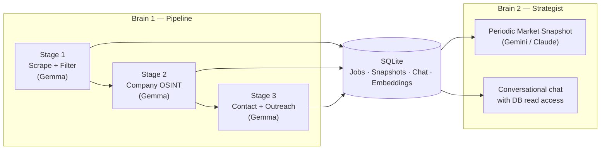

<!-- =========================================================
  README HEADER
  Replace the line below with your logo. 576px works well.
========================================================= -->
<p align="center">
  
</p>

<h1 align="center">HunterJobs ATS</h1>

<p align="center">
  <em>A candidate-side applicant tracking system.</em>
</p>

<p align="center">
  
  
  
  
  
  
  
</p>

<p align="center">
  <sub><strong>v0.2 just shipped</strong> — RAG over past applications, OpenAI backend, hardened scraping. <a href="#changelog--roadmap">See changelog ↓</a></sub>
</p>

---

## What it is

HunterJobs is a local Python app that runs a three-stage AI pipeline against job listings: it scrapes them, judges them against your profile, then researches the company and drafts an outreach message for the ones worth pursuing. It runs on your machine, talks to your LLM of choice, and stores everything in a local SQLite file. No accounts, no cloud, no SaaS.

The web UI is a desktop dashboard — Jobs / Applied / Market Analyzer / Logs / Setup. Pick a backend (Gemini, Claude, Gemma, OpenAI, or a local LM Studio model), set your profile, hit Run, watch jobs stream in.

> ⚠️ **Work in progress.** Most of it works. Some bits are clanky. Feedback welcome.

<!-- HERO SCREENSHOT: Jobs tab with several expanded listings, dark theme, one colored row visible -->


---

## Why this exists

The job market is broken from a candidate's side. Recruiter spam, ghost listings, staffing agencies dressed up as employers, the same 12 roles re-uploaded across 6 boards. The standard "spray 200 applications, hope for 3 interviews" approach burns weeks for almost no signal.

So this is the inverse of what most ATSes do. Most ATSes serve employers — they help companies filter candidates. HunterJobs serves you — it filters everything *they* throw at the market down to a small set of jobs that actually match what you can do, with enough context to write a real outreach email.

**This is not an autoapply tool.** It does not mass-submit applications, it does not auto-send emails, it does not pretend to be you on LinkedIn. It does the parts of job hunting that suck — scraping, filtering, researching, drafting starting points — and then it gets out of the way. You read the draft, you rewrite it in your own voice, you decide who to reach out to and when. The goal is to give you fewer, better leads with more context, not to add to the noise.

It started as a smaller hack I built for myself — a script that filtered out trash listings on LinkedIn so I'd stop wasting time on them. The current version is the grown-up version of that idea: it doesn't just filter, it researches and drafts. Three LLM calls in a row, each doing one thing well.


---

## How it works

Two AI "brains" running locally on your machine, sharing one SQLite database.



**Brain 1** is the pipeline. Three LLM calls per job, in order:

| Stage | What it does | LLM |
|------:|---|---|
| 1 | Scrape job boards, hard-reject obvious noise (keyword blacklist), then GOOD/MAYBE/BAD verdict against your profile. | Gemma 4 (free tier on Google AI Studio) |
| 2 | For GOOD jobs: scrape the company website, classify size, real stack, hiring signal, culture flags. Auto-demote to BAD if it's a staffing agency / IT consulting body-shop wearing a product-company costume. | Gemma 4 |
| 3 | For Stage 2 survivors: GitHub OSINT (public commit emails) → email permutation fallback → drafts a cold outreach. The draft is a starting point, not autopilot. | Gemma 4 |

**Brain 2** is the strategist. Periodically aggregates your last 7 days of data and produces a brutal report on positioning, salary realism, surging skills, and patterns in your rejection pile. You can also chat with it — it has read-only SQL access to your jobs table so you can ask "show me the 11 GOOD jobs sorted by salary" and it'll run an actual query.

Both Brains talk to a local SQLite database (WAL mode + FTS5 for full-text search) so the UI can read and write without locking.

### Similar past applications (RAG)

Every job that survives the keyword pre-filter gets embedded at scrape time and stored as a vector alongside the listing. When you open a job, HunterJobs surfaces the applications you've *already* applied to that are semantically closest to it — so you can see "I applied to three roles like this one, here's how they went" without digging through your history.

It's built to stay inside the single-file philosophy: embeddings live in the same SQLite database via [`sqlite-vec`](https://github.com/asg017/sqlite-vec), and vectors come from Gemini's `gemini-embedding-001` (768-dim) using the same backend you've already configured — no extra services, no separate vector store. A one-shot **Backfill** button in the Setup tab embeds your existing jobs. If the extension can't load on your platform, the rest of the app runs fine and the feature degrades quietly.

---

## Stack

Python 3.10+, NiceGUI dashboard (FastAPI + Vue under the hood), SQLite (WAL + FTS5 + sqlite-vec), Pydantic v2 for structured LLM outputs, python-jobspy for the LinkedIn scraping.

**LLM backends supported:**
- **Google Gemini / Gemma** via the google-genai SDK — Gemma 4 is free on Tier 1; Gemini also powers embeddings for the RAG feature
- **Anthropic Claude** — Sonnet 4.6 (recommended), Opus, Haiku 4.5
- **OpenAI** — for Brain 2
- **LM Studio** — any local OpenAI-compatible endpoint

You can mix and match. The default config uses free Gemma for the high-volume Brain 1 calls and a paid model only for Brain 2 (which runs ~1–2 calls per day).

---

## Install

```bash
git clone https://github.com/mustar22/hunterjobs-ats.git
cd hunterjobs-ats
pip install -r requirements.txt
cp keys_dummy.py keys.py    # then edit keys.py and add your API key(s)
```

Then launch with whichever is easier:

- **Windows:** double-click `_start.bat`
- **macOS / Linux:** `chmod +x _start.sh && ./_start.sh`
- **Or from terminal:** `python dashboard.py`

Open http://localhost:8080 in your browser. A default `config.json` is created automatically on first run — set your profile in the Setup tab.

You only need a `GOOGLE_API_KEY` to start — get one free at https://aistudio.google.com/apikey. The other keys (`ANTHROPIC_API_KEY`, `OPENAI_API_KEY`, `GITHUB_PAT`) are optional.

> **Running the tests?** Install pytest first: `pip install pytest`, then run `pytest` from the repo root.


---

## Configure

Open the **Setup** tab and:

1. Paste your profile into the **Profile** textarea. Be specific. Stack, years of experience, salary floor, location constraints, hard nos. The richer this is, the better Stage 1 filters.
2. Edit **Search Terms** — one per line. These get passed to JobSpy as LinkedIn queries.
3. Edit the **Hard Rejects** keyword list. Anything matched here gets auto-BAD without burning an LLM call. Default list catches the obvious staffing/recruiting/US-only stuff. You can export/import this as a `.txt` to share with others.
4. Pick your backends. Defaults are sensible — Gemma 4 for Brain 1, Gemini Flash for Brain 2.
5. (Optional) Hit **Backfill embeddings** to enable "similar past applications" over jobs you scraped before the RAG feature existed.


---

## Privacy

Everything is local. Your profile, scraped jobs, notes, color labels, chat history, embeddings — all in `db/hunterjobs_ats.db` on your machine. The only network calls go to the LLM provider you pick (or none at all if you use LM Studio).

Your `keys.py` is gitignored. Don't commit it.

---

## Known limitations

- **JobSpy can be flaky** — LinkedIn occasionally rate-limits, and JobSpy 1.1.82 has a bug where it mis-parses some listings' locations into an invalid-country error that aborts the whole scrape. HunterJobs patches around that at runtime (see the comment block in `brain1.py`), but a search term can still occasionally produce nothing on a given day.
- **LinkedIn doesn't always return a posting date or location** — some rows show blank for those. That's upstream data, not a bug.
- **Stage 2/3 fail more often than I'd like** — Gemma 4 sometimes returns malformed JSON or just times out. There are manual retry buttons inside each job's expansion for both.
- **Local models < 20B params chat poorly with tools.** They'll echo the tool result back into their text. Snapshot generation with local models is fine; chat works best with Gemini or Claude.
- **The outreach drafts are okay, not great.** They're meant as a starting point — read each one, rewrite it in your own voice, decide if you actually want to send it. This is intentional. The point of HunterJobs is to give you better leads and a head start, not to send things for you.

---

## Changelog & Roadmap

### ✅ v0.2 — shipped

- **RAG over past applications** — semantic "similar past applications" via sqlite-vec + Gemini embeddings, surfaced passively in each job's panel
- **OpenAI backend** for Brain 2 (joins Gemini, Gemma, Claude, LM Studio)
- **Manual "Move to BAD"** button on GOOD/MAYBE jobs
- **pytest suite + GitHub Actions CI** — 43 tests, green badge above
- **Hardened JobSpy scraping** — runtime fix for the 1.1.82 invalid-country crash that aborted scrapes containing foreign-location listings

### 🔜 v0.3 — planned

- YC "Work at a Startup" scraper alongside JobSpy/LinkedIn
- Configurable target region/country for scraping
- Multi-thread chat (currently one persistent conversation)
- Outreach send-tracking with calendar reminders
- More job sources beyond LinkedIn

---

## Feedback

This is a tool I'm using daily for my own job hunt. If something's broken or weird, open an issue. If you have ideas, also open an issue. If you want to use it and got stuck on setup, definitely open an issue — the install docs probably need work.

PRs welcome but please open an issue first so we can sync on direction.

---

## License

Apache-2.0 — see [LICENSE](LICENSE).
