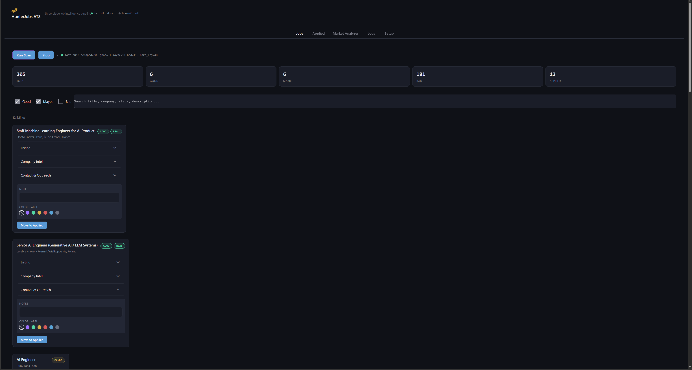
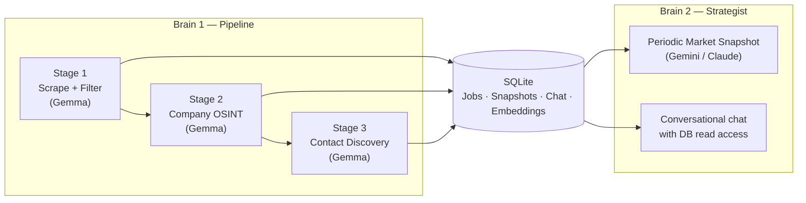
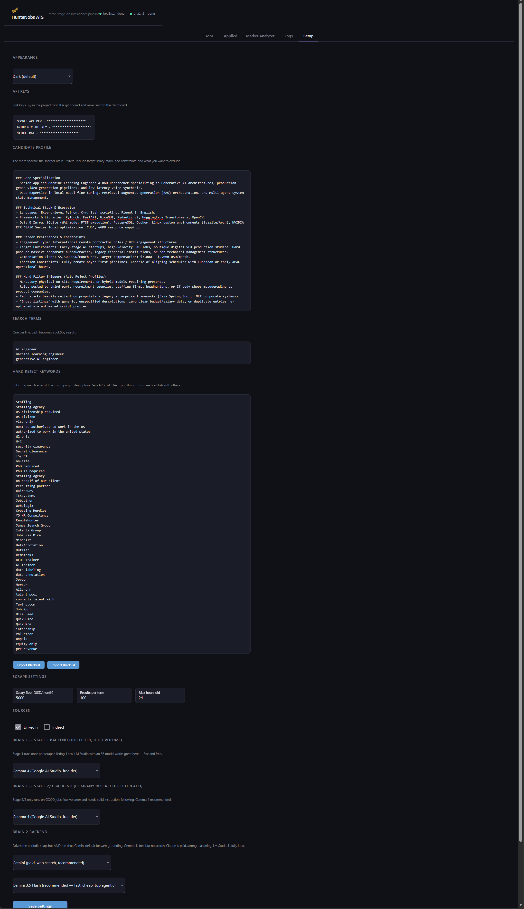
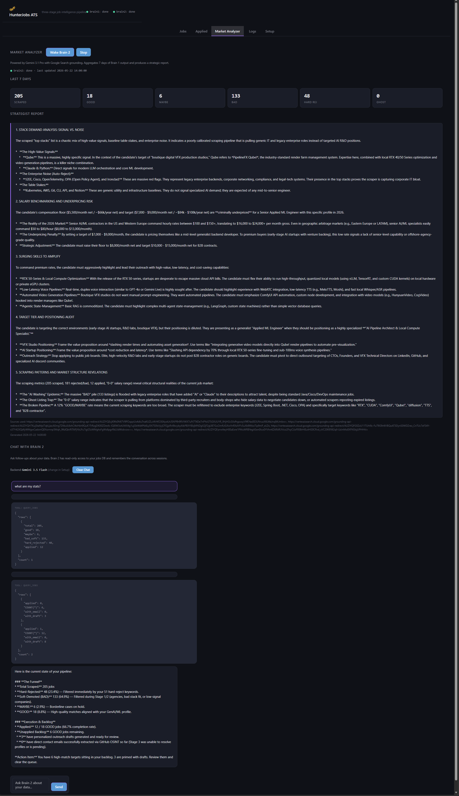

<!-- =========================================================
  README HEADER
  Replace the line below with your logo. 576px works well.
========================================================= -->
<p align="center">
  
</p>

<h1 align="center">HunterJobs ATS</h1>

<p align="center">
  <em>A candidate-side applicant tracking system.</em>
</p>

<p align="center">
  
  
  
  
  
  
  
</p>

<p align="center">
  <sub><strong>v0.4.3 just shipped</strong> &mdash; Hacker News "Who is Hiring?" source, real contact discovery (no more guessed names), OpenRouter backend. <a href="#changelog--roadmap">See changelog &darr;</a></sub>
</p>

---

## What it is

HunterJobs is a local Python app that runs a three-stage AI pipeline against job listings: it scrapes them, judges them against your profile, then researches the company and finds real people to reach out to for the ones worth pursuing. It runs on your machine, talks to your LLM of choice, and stores everything in a local SQLite file. No accounts, no cloud, no SaaS.

It pulls jobs from LinkedIn, Indeed, Y Combinator startups (scraped straight from each company's ATS board), and the monthly Hacker News "Who is Hiring?" thread. The web UI is a desktop dashboard &mdash; Jobs / Applied / Market Analyzer / Logs / Setup. Pick your sources and a backend (Gemini, Claude, Gemma, OpenAI, OpenRouter, or a local LM Studio model), set your profile, hit Run, watch jobs stream in.

> **Work in progress.** Most of it works. Some bits are clanky. Feedback welcome.

<!-- HERO SCREENSHOT: Jobs tab with several expanded listings, dark theme, one colored row visible -->



---

## Why this exists

The job market is broken from a candidate's side. Recruiter spam, ghost listings, staffing agencies dressed up as employers, the same 12 roles re-uploaded across 6 boards. The standard "spray 200 applications, hope for 3 interviews" approach burns weeks for almost no signal.

So this is the inverse of what most ATSes do. Most ATSes serve employers &mdash; they help companies filter candidates. HunterJobs serves you &mdash; it filters everything *they* throw at the market down to a small set of jobs that actually match what you can do, with enough context to write a real outreach email.

**This is not an autoapply tool.** It does not mass-submit applications, it does not auto-send emails, it does not pretend to be you on LinkedIn. It does the parts of job hunting that suck &mdash; scraping, filtering, researching, finding the right person to contact &mdash; and then it gets out of the way. You decide who to reach out to, what to say, and when. The goal is to give you fewer, better leads with more context, not to add to the noise.

It started as a smaller hack I built for myself &mdash; a script that filtered out trash listings on LinkedIn so I'd stop wasting time on them. The current version is the grown-up version of that idea: it doesn't just filter, it researches the company and surfaces real people to contact. Three LLM calls in a row, each doing one thing well.


---

## How it works

Two AI "brains" running locally on your machine, sharing one SQLite database.



**Brain 1** is the pipeline. Three LLM calls per job, in order:

| Stage | What it does | LLM |
|------:|---|---|
| 1 | Scrape job boards, hard-reject obvious noise (keyword blacklist), then GOOD/MAYBE/BAD verdict against your profile. | Gemma 4 (free tier on Google AI Studio) |
| 2 | For GOOD jobs: scrape the company website, classify size, real stack, hiring signal, culture flags. Auto-demote to BAD if it's a staffing agency / IT consulting body-shop wearing a product-company costume. | Gemma 4 |
| 3 | For Stage 2 survivors: real contact discovery &mdash; team-page scrape + web search + GitHub org members, surfacing real names sorted decision-maker-first, with name-to-email permutation and on-demand per-person email search. No guessed names, no auto-drafts &mdash; honest "unknown" when nothing's found. | Gemma 4 |

**Brain 2** is the strategist. Periodically aggregates your last 7 days of data and produces a brutal report on positioning, salary realism, surging skills, and patterns in your rejection pile. You can also chat with it &mdash; it has read-only SQL access to your jobs table so you can ask "show me the 11 GOOD jobs sorted by salary" and it'll run an actual query. An editable **persona** field shapes its voice and behavior across both the snapshot and chat.

Both Brains talk to a local SQLite database (WAL mode + FTS5 for full-text search) so the UI can read and write without locking.

### Job sources

HunterJobs pulls from four sources, mix-and-match in the Setup tab &mdash; each tagged with a colored badge in the job list so you can see at a glance where a listing came from (LinkedIn blue, Indeed navy, YC red-orange, HN orange-yellow):

- **LinkedIn** and **Indeed** &mdash; via [python-jobspy](https://github.com/cullenwatson/JobSpy), term-based search against your search terms.
- **Y Combinator startups** *(v0.3)* &mdash; powered by my companion package [`ycombinator-jobs-scraper`](https://github.com/mustar22/ycombinator-jobs-scraper). It pulls currently-hiring YC companies from the public [yc-oss](https://github.com/yc-oss/api) dataset, filters them down to small early-stage startups (configurable team-size cap), and scrapes jobs straight from each company's ATS board (Greenhouse / Lever / Ashby) &mdash; full descriptions, no auth. These are the kinds of roles that rarely make it to LinkedIn.
- **Hacker News "Who is Hiring?"** *(new in v0.4.3)* &mdash; finds the newest monthly thread via the free HN Algolia + Firebase APIs (no auth) and parses each top-level comment into a job. Regex pulls the easy fields; the raw comment becomes the description Stage 1 judges.

YC and HN jobs can be filtered to **remote-only** before they ever reach Stage 1, and both respect the same freshness window, so stale or non-remote listings don't burn LLM calls. You can run any combination of sources, including YC or HN on their own.

### Similar past applications (RAG)

Every job that survives the keyword pre-filter gets embedded at scrape time and stored as a vector alongside the listing. When you open a job, HunterJobs surfaces the applications you've *already* applied to that are semantically closest to it &mdash; so you can see "I applied to three roles like this one, here's how they went" without digging through your history.

It's built to stay inside the single-file philosophy: embeddings live in the same SQLite database via [`sqlite-vec`](https://github.com/asg017/sqlite-vec), and vectors come from Gemini's `gemini-embedding-001` (768-dim) using the same backend you've already configured &mdash; no extra services, no separate vector store. A one-shot **Backfill** button in the Setup tab embeds your existing jobs. If the extension can't load on your platform, the rest of the app runs fine and the feature degrades quietly.

---

## Stack

Python 3.10+, NiceGUI dashboard (FastAPI + Vue under the hood), SQLite (WAL + FTS5 + sqlite-vec), Pydantic v2 for structured LLM outputs, python-jobspy for LinkedIn/Indeed scraping, and [`ycombinator-jobs-scraper`](https://github.com/mustar22/ycombinator-jobs-scraper) for the YC source.

**LLM backends supported:**
- **Google Gemini / Gemma** via the google-genai SDK &mdash; Gemma 4 is free on Tier 1; Gemini also powers embeddings for the RAG feature
- **Anthropic Claude** &mdash; Sonnet 4.6 (recommended), Opus, Haiku 4.5
- **OpenAI** &mdash; for Brain 2
- **OpenRouter** &mdash; OpenAI-compatible, with a live model picker that fetches the catalog (searchable, free + paid models with pricing shown inline)
- **LM Studio** &mdash; any local OpenAI-compatible endpoint

You can mix and match. Brain 1's stages take separate backends &mdash; Stage 1 (high volume) and Stages 2/3 (research + contacts) &mdash; and when running on Gemma each stage picks its own model from a live picker. The default config uses free Gemma for the high-volume Brain 1 calls and a paid model only for Brain 2 (which runs ~1-2 calls per day).

---

## Install

```bash
git clone https://github.com/mustar22/hunterjobs-ats.git
cd hunterjobs-ats
pip install -e .            # installs deps and puts core/pipeline/ui on the path
cp keys_dummy.py keys.py    # then edit keys.py and add your API key(s)
```

(`pip install -e .` reads its dependencies from `requirements.txt`; a plain
`pip install -r requirements.txt` also works if you just want the deps.)

Then launch with whichever is easier:

- **Windows:** double-click `_start.bat`
- **macOS / Linux:** `chmod +x _start.sh && ./_start.sh`
- **Or from terminal:** `python dashboard.py`

Open http://localhost:8080 in your browser. A default `config.json` is created automatically on first run &mdash; set your profile in the Setup tab.

You only need a `GOOGLE_API_KEY` to start &mdash; get one free at https://aistudio.google.com/apikey. The other keys (`ANTHROPIC_API_KEY`, `OPENAI_API_KEY`, `OPENROUTER_API_KEY`, `GITHUB_PAT`) are optional &mdash; `GITHUB_PAT` lets Stage 3 read GitHub org members for contacts. The YC and HN sources need no key &mdash; they use public endpoints.

> **Running the tests?** Install pytest first: `pip install pytest`, then run `pytest` from the repo root.



---

## Configure

Open the **Setup** tab and:

1. Paste your profile into the **Profile** textarea. Be specific. Stack, years of experience, salary floor, location constraints, hard nos. The richer this is, the better Stage 1 filters.
2. Pick your **sources** &mdash; LinkedIn, Indeed, Y Combinator startups, and/or Hacker News "Who is Hiring?". For YC you can set a max team size (to target small startups); YC and HN each have a remote-only toggle.
3. Edit **Search Terms** &mdash; one per line. These get passed to JobSpy as LinkedIn/Indeed queries. (YC scrapes whole companies, so Stage 1's LLM does the matching there.)
4. Edit the **Hard Rejects** keyword list. Anything matched here gets auto-BAD without burning an LLM call. Default list catches the obvious staffing/recruiting/US-only stuff. You can export/import this as a `.txt` to share with others.
5. Pick your backends. Brain 1's Stage 1 and Stages 2/3 are set separately; on Gemma, each stage gets its own model picker. Defaults are sensible &mdash; Gemma 4 for Brain 1, Gemini Flash for Brain 2.
6. (Optional) Hit **Backfill embeddings** to enable "similar past applications" over jobs you scraped before the RAG feature existed.



---

## Privacy

Everything is local. Your profile, scraped jobs, notes, color labels, chat history, embeddings &mdash; all in `db/hunterjobs_ats.db` on your machine. The only network calls go to the LLM provider you pick (or none at all if you use LM Studio), plus the job-board/ATS endpoints when scraping.

Stage 3 contact discovery only surfaces publicly available information &mdash; names and roles from company team pages, public web results, and public GitHub org membership &mdash; so you can address one real person instead of `careers@`. It guesses nothing: when there's no public signal, it says so.

Your `keys.py` is gitignored. Don't commit it.

---

## Known limitations

- **JobSpy can be flaky** &mdash; LinkedIn occasionally rate-limits, and JobSpy 1.1.82 has a bug where it mis-parses some listings' locations into an invalid-country error that aborts the whole scrape. HunterJobs patches around that at runtime (see the comment block in `pipeline/brain1.py`), but a search term can still occasionally produce nothing on a given day.
- **YC ATS coverage is partial** &mdash; the YC source resolves a company's ATS by matching its slug and checking its website for a board link. Companies on unsupported ATSs (Workday, Rippling) or with JavaScript-only boards are missed. Coverage skews toward companies using Greenhouse / Lever / Ashby.
- **LinkedIn doesn't always return a posting date or location** &mdash; some rows show blank for those. That's upstream data, not a bug.
- **Stage 2/3 fail more often than I'd like** &mdash; Gemma 4 sometimes returns malformed JSON or just times out. There are manual retry buttons inside each job's expansion for both.
- **Local models < 20B params chat poorly with tools.** They'll echo the tool result back into their text. Snapshot generation with local models is fine; chat works best with Gemini or Claude.
- **Contact discovery is best-effort.** Team pages vary wildly, GitHub org membership is often private, and permuted emails are educated guesses (marked as such). Often the honest answer is "no public contact found" &mdash; that's by design, not a failure. Use the per-person email search on the few people who matter.

---

## Changelog & Roadmap

### v0.4.3 — shipped

- **Hacker News "Who is Hiring?" source** &mdash; newest monthly thread via free HN Algolia + Firebase APIs (no auth), each comment parsed into a job; respects the remote-only and freshness filters
- **Per-stage Gemma model selection** &mdash; Stage 1 / 2 / 3 each pick their own Gemma model from a live picker that fetches the Google AI Studio catalog
- Fixes: tightened the Stage 2 staffing/agency demote (data-labeling *products* like Trace Labs no longer false-demoted); a guard against runaway/repeating company summaries

### v0.4.2 — shipped

- **Real contact discovery** &mdash; team-page scrape + web search + GitHub org members, real names sorted decision-maker-first, name-to-email permutation, and on-demand per-person targeted email search
- **YC freshness filter** &mdash; YC jobs now respect the same hours-old window as the job boards, so stale listings stop leaking in

### v0.4.1 — shipped

- **Stage 3 contact honesty fix** &mdash; stopped fabricating names and auto-drafts (the model was inventing the same fake person across companies); multi-contact column + picker UI, honest "no contact" when none found

### v0.4 — shipped

- **OpenRouter backend** for Brain 1 and Brain 2 &mdash; OpenAI-compatible, with a live model picker that fetches the OpenRouter catalog (searchable, shows free/paid pricing inline)
- **Brain 2 persona** &mdash; an editable voice/behavior field in Setup that shapes both the market snapshot and chat
- **Package restructure** &mdash; flat layout split into `core/` / `pipeline/` / `ui/` packages with a proper `pyproject.toml` editable install; `dashboard.py` slimmed from ~2300 lines to a thin entry point
- **Dev tooling** &mdash; a wipe script to clear personal data before pushing
- Fixes: stale-PID guard so brains restart cleanly after finishing or being stopped; Brain 2 backend label no longer hardcoded to Gemini

### v0.3 — shipped

- **Y Combinator startups as a job source** &mdash; via the companion [`ycombinator-jobs-scraper`](https://github.com/mustar22/ycombinator-jobs-scraper) package; targets small early-stage YC startups and scrapes full descriptions from their ATS boards
- **Source picker + badges** &mdash; run LinkedIn / Indeed / YC in any combination (including YC-only); each job is tagged with a colored source badge
- **Remote-only filter for YC jobs** &mdash; drops non-remote listings before Stage 1 so they don't burn LLM calls
- Fixes: duplicate-embedding crash on multi-location listings (idempotent embeds + unique IDs), and a NiceGUI timer error from the embeddings backfill

### v0.2 — shipped

- **RAG over past applications** &mdash; semantic "similar past applications" via sqlite-vec + Gemini embeddings, surfaced passively in each job's panel
- **OpenAI backend** for Brain 2 (joins Gemini, Gemma, Claude, LM Studio)
- **Manual "Move to BAD"** button on GOOD/MAYBE jobs
- **pytest suite + GitHub Actions CI** &mdash; green badge above
- **Hardened JobSpy scraping** &mdash; runtime fix for the 1.1.82 invalid-country crash that aborted scrapes containing foreign-location listings

### Planned

- Configurable target region/country for scraping
- Multi-thread chat (currently one persistent conversation)
- Outreach send-tracking with calendar reminders

---

## Feedback

This is a tool I'm using daily for my own job hunt. If something's broken or weird, open an issue. If you have ideas, also open an issue. If you want to use it and got stuck on setup, definitely open an issue &mdash; the install docs probably need work

PRs welcome but please open an issue first so we can sync on direction

---

## License

Apache-2.0 &mdash; see [LICENSE](LICENSE).