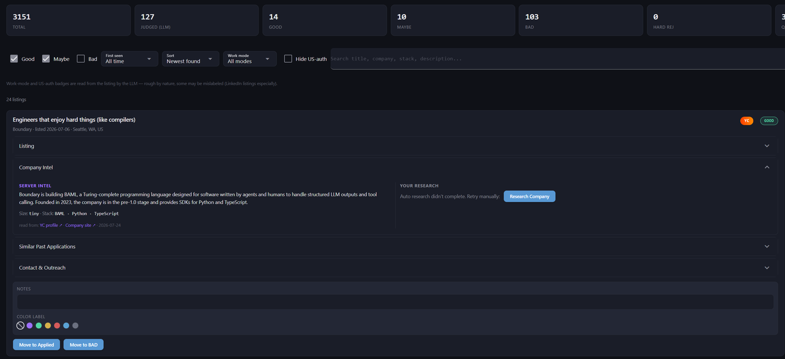
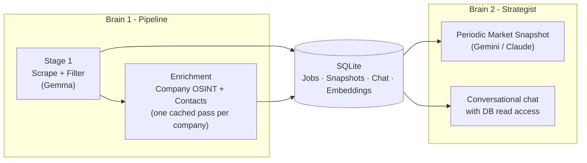
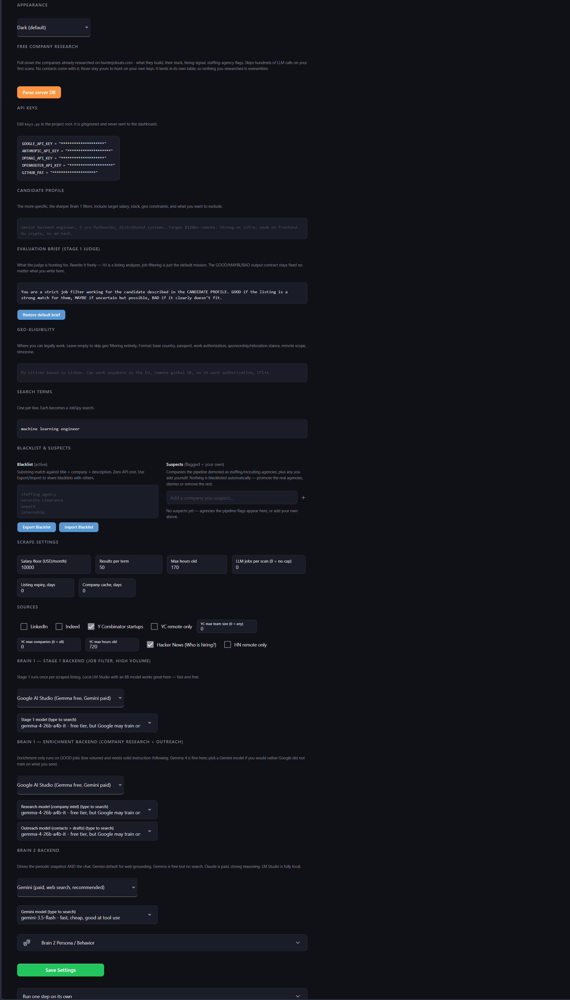
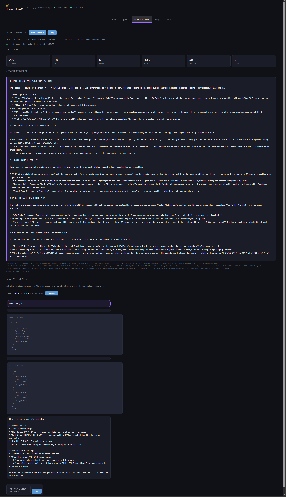

<!-- =========================================================
  README HEADER
  Replace the line below with your logo. 576px works well.
========================================================= -->
<p align="center">
  
</p>

<h1 align="center">HunterJobs ATS</h1>

<p align="center">
  <em>A candidate-side applicant tracking system.</em>
</p>

<p align="center">
  
  
  
  
  
  
  
  
</p>

<p align="center">
  <sub><strong>v0.8.0 just shipped</strong> - one button pulls down a few thousand companies I already researched plus YC/HN listings to judge, and every model picker is live now. <a href="#changelog--roadmap">See changelog &darr;</a></sub>
</p>

---

## What it is

A local Python app that reads job listings so you don't have to. It scrapes them, judges each one against your profile, and for the ones worth your time it researches the company and digs up real people to contact. Everything runs on your machine against your own LLM key, stored in a plain SQLite file. No accounts, no cloud, no SaaS.

Sources: LinkedIn, Y Combinator startups (scraped straight off each company's ATS board), and the monthly Hacker News "Who is Hiring?" thread. (Indeed is wired up but currently disabled - jobspy's Indeed scraper stopped returning anything, so it's greyed out rather than pretending.) The UI is a desktop dashboard: Jobs / Applied / Market Analyzer / Logs / Setup. Pick your sources, pick a backend (Gemini, Claude, Gemma, OpenAI, OpenRouter, or a local LM Studio model), paste your profile, hit Run. Jobs stream in as they're judged.

> **Work in progress.** Most of it works. Some bits are clanky. Feedback welcome.

<!-- HERO SCREENSHOT: Jobs tab with several expanded listings, dark theme, one colored row visible -->



---

## Why this exists

The job market is broken from a candidate's side. Recruiter spam, ghost listings, staffing agencies dressed up as employers, the same 12 roles re-uploaded across 6 boards. Spray 200 applications, hope for 3 interviews. Weeks of your life for almost no signal.

So this is the inverse of a normal ATS. Those serve employers, helping companies filter candidates. This one serves you: it filters everything *they* throw at the market down to a short list that actually matches what you can do, with enough context to write a real email to a real person.

**It is not an autoapply tool.** No mass submissions, no auto-sent emails, nothing pretending to be you on LinkedIn. It does the parts that suck (scraping, filtering, researching, finding who to contact) and then gets out of your way. Who you write to and what you say stays yours. Fewer and better leads, not more noise.

It started as a script I hacked together for myself, just to stop LinkedIn trash from eating my evenings. This is that idea grown up: it doesn't only filter, it researches the company and hands you real people to contact. Three LLM calls in a row, each doing one job properly.


---

## How it works

Two AI "brains" running locally on your machine, sharing one SQLite database.


```mermaid
flowchart LR
    subgraph Brain1["Brain 1 - Pipeline"]
        direction TB
        S1["Stage 1<br/>Scrape + Filter<br/>(Gemma)"] --> S2["Enrichment<br/>Company OSINT + Contacts<br/>(one cached pass per company)"]
    end

    subgraph Brain2["Brain 2 - Strategist"]
        Snap["Periodic Market Snapshot<br/>(Gemini / Claude)"]
        Chat["Conversational chat<br/>with DB read access"]
    end

    DB[(SQLite<br/>Jobs · Snapshots · Chat · Embeddings)]

    S1 --> DB
    S2 --> DB
    DB --> Snap
    DB --> Chat
```

**Brain 1** is the pipeline:

| Stage | What it does | LLM |
|------:|---|---|
| 1 | Scrape job boards, hard-reject obvious noise (keyword blacklist), then GOOD/MAYBE/BAD verdict against your profile - up to your per-scan budget; overflow queues for the next scan. | Gemma 4 (free tier on Google AI Studio) |
| Enrichment | For GOOD jobs, one cached pass per company: research (size, real stack, hiring signal, staffing-agency demote) **and** contact discovery in a single call. Contacts come from emails printed in the posting itself, YC profile founders, team pages, GitHub orgs, and web search - real names sorted decision-maker-first, guessed emails clearly marked, honest "unknown" when nothing's found. Cached 30 days, so five jobs at one company cost one pass. | Gemma 4 |

**Brain 2** is the strategist. Periodically aggregates your last 7 days of data and produces a brutal report on positioning, salary realism, surging skills, and patterns in your rejection pile. You can also chat with it - it has read-only SQL access to your jobs table so you can ask "show me the 11 GOOD jobs sorted by salary" and it'll run an actual query. An editable **persona** field shapes its voice and behavior across both the snapshot and chat.

Both Brains talk to a local SQLite database (WAL mode + FTS5 for full-text search) so the UI can read and write without locking.

### Job sources

HunterJobs pulls from four sources, mix-and-match in the Setup tab - each tagged with a colored badge in the job list so you can see at a glance where a listing came from (LinkedIn blue, Indeed navy, YC red-orange, HN orange-yellow):

- **LinkedIn** - via [python-jobspy](https://github.com/cullenwatson/JobSpy), term-based search against your search terms. **Indeed** goes through the same library but is disabled right now: it came back empty across 21 broad terms, so the toggle is greyed until that's fixed.
- **Y Combinator startups** *(v0.3)* - powered by my companion package [`ycombinator-jobs-scraper`](https://github.com/mustar22/ycombinator-jobs-scraper). It pulls currently-hiring YC companies from the public [yc-oss](https://github.com/yc-oss/api) dataset, filters them down to small early-stage startups (configurable team-size cap), and scrapes jobs straight from each company's ATS board (Greenhouse / Lever / Ashby), falling back to the Work-at-a-Startup postings on the company's public YC profile page when there's no discoverable ATS - **~100% of hiring companies covered**, no auth. These are the kinds of roles that rarely make it to LinkedIn.
- **Hacker News "Who is Hiring?"** *(new in v0.4.3)* - finds the newest monthly thread via the free HN Algolia + Firebase APIs (no auth) and parses each top-level comment into a job. Regex pulls the easy fields; the raw comment becomes the description Stage 1 judges.

YC and HN jobs can be filtered to **remote-only** before they ever reach Stage 1, so non-remote listings don't burn LLM calls. Freshness is windowed too: HN shares the global "Max hours old", while YC gets its own wider window (`yc_hours_old`, default 720h / 30 days) - YC startups leave postings up for months, so the tight job-board window would discard most of them. You can run any combination of sources, including YC or HN on their own.

### Similar past applications (RAG)

Every job that survives the keyword pre-filter gets embedded at scrape time and stored as a vector alongside the listing. When you open a job, HunterJobs surfaces the applications you've *already* applied to that are semantically closest to it - so you can see "I applied to three roles like this one, here's how they went" without digging through your history.

It's built to stay inside the single-file philosophy: embeddings live in the same SQLite database via [`sqlite-vec`](https://github.com/asg017/sqlite-vec), and vectors come from Gemini's `gemini-embedding-001` (768-dim) using the same backend you've already configured - no extra services, no separate vector store. A one-shot **Backfill** button in the Setup tab embeds your existing jobs. If the extension can't load on your platform, the rest of the app runs fine and the feature degrades quietly.

---

## Stack

Python 3.10+, NiceGUI dashboard (FastAPI + Vue under the hood), SQLite (WAL + FTS5 + sqlite-vec), Pydantic v2 for structured LLM outputs, python-jobspy for LinkedIn/Indeed scraping, and [`ycombinator-jobs-scraper`](https://github.com/mustar22/ycombinator-jobs-scraper) for the YC source.

**LLM backends supported:**
- **Google Gemini / Gemma** via the google-genai SDK - Gemma 4 is free on Tier 1; Gemini also powers embeddings for the RAG feature
- **Anthropic Claude** - Sonnet 4.6 (recommended), Opus, Haiku 4.5
- **OpenAI** - for Brain 2
- **OpenRouter** - OpenAI-compatible, with a live model picker that fetches the catalog (searchable, free + paid models with pricing shown inline)
- **LM Studio** - any local OpenAI-compatible endpoint

You can mix and match. Brain 1's stages take separate backends - Stage 1 (high volume) and Stages 2/3 (research + contacts) - and when running on Gemma each stage picks its own model from a live picker. The default config uses free Gemma for the high-volume Brain 1 calls and a paid model only for Brain 2 (which runs ~1-2 calls per day).

---

## Install

```bash
git clone https://github.com/mustar22/hunterjobs-ats.git
cd hunterjobs-ats
python scripts/setup.py     # installs everything; see below
```

`scripts/setup.py` is the canonical setup: it installs HunterJobs (editable, deps
from `requirements.txt`), clones the companion [`ycombinator-jobs-scraper`](https://github.com/mustar22/ycombinator-jobs-scraper)
into a sibling directory and editable-installs it, verifies the scraper imports
from local source, and seeds `config.json` / `keys.py` (then edit `keys.py` and
add your API key(s)). Idempotent - re-run it anytime to pull scraper updates.

> A bare `pip install -e .` does **not** install the YC scraper - the YC source
> will be skipped until you run `scripts/setup.py`.

Then launch with whichever is easier:

- **Windows:** double-click `_start.bat`
- **macOS / Linux:** `chmod +x _start.sh && ./_start.sh`
- **Or from terminal:** `python dashboard.py`

Open http://localhost:8080 in your browser. A default `config.json` is created automatically on first run - set your profile in the Setup tab.

You only need a `GOOGLE_API_KEY` to start - get one free at https://aistudio.google.com/apikey. The other keys (`ANTHROPIC_API_KEY`, `OPENAI_API_KEY`, `OPENROUTER_API_KEY`, `GITHUB_PAT`) are optional - `GITHUB_PAT` lets Stage 3 read GitHub org members for contacts. The YC and HN sources need no key - they use public endpoints.

> **Running the tests?** Install pytest first: `pip install pytest`, then run `pytest` from the repo root.



---

## Configure

Open the **Setup** tab and:

1. Paste your profile into the **Profile** textarea. Be specific. Stack, years of experience, salary floor, location constraints, hard nos. The richer this is, the better Stage 1 filters.
2. Pick your **sources** - LinkedIn, Y Combinator startups, and/or Hacker News "Who is Hiring?". For YC you can set a max team size (to target small startups) and a YC-specific freshness window ("YC max hours old", default 720); YC and HN each have a remote-only toggle. The global "Max hours old" governs LinkedIn/Indeed/HN only.
3. Edit **Search Terms** - one per line. These get passed to JobSpy as LinkedIn/Indeed queries. (YC scrapes whole companies, so Stage 1's LLM does the matching there.)
4. Edit the **Hard Rejects** keyword list. Anything matched here gets auto-BAD without burning an LLM call. Default list catches the obvious staffing/recruiting/US-only stuff. You can export/import this as a `.txt` to share with others.
5. Pick your backends. Brain 1's Stage 1 and Enrichment are set separately, and every picker is live - it asks the provider what it serves today rather than reading a list I hardcoded and forgot to update. Defaults are sensible: Gemma 4 for Brain 1, Gemini Flash for Brain 2. On Google you can pick either family; Gemma is the free tier (Google may train on what you send it), Gemini is paid and they don't.
6. **Fastest start: hit the orange "Parse server DB" button** at the top of Setup. It pulls down ~1,900 companies I've already researched plus ~3,100 YC and Hacker News listings, so your first run has something to judge and skips the research bill on companies already known. Nothing in it is judged for you - your profile decides. It brings no contacts and no LinkedIn/Indeed listings; hunt and scrape those yourself.
7. **Strongly recommended: add a `TAVILY_API_KEY` or `SERPER_API_KEY`** (both have free tiers). The keyless fallback works from some connections and not others - datacenter IPs get starved and several countries get captcha-walled, and when search silently returns nothing the company research quietly gets much worse. I found this the hard way: 92% of one enrichment run came back with no sources read. With a key it was 0%.
8. (Optional) Hit **Backfill embeddings** to enable "similar past applications" over jobs you scraped before the RAG feature existed.



---

## Privacy

Everything is local. Your profile, scraped jobs, notes, color labels, chat history, embeddings - all in `core/db/hunterjobs_ats.db` on your machine. The only network calls go to the LLM provider you pick (or none at all if you use LM Studio), plus the job-board/ATS endpoints when scraping.

Stage 3 contact discovery only surfaces publicly available information - names and roles from company team pages, public web results, and public GitHub org membership - so you can address one real person instead of `careers@`. It guesses nothing: when there's no public signal, it says so.

Your `keys.py` is gitignored. Don't commit it.

---

## Known limitations

- **JobSpy can be flaky** - LinkedIn occasionally rate-limits, and JobSpy 1.1.82 has a bug where it mis-parses some listings' locations into an invalid-country error that aborts the whole scrape. HunterJobs patches around that at runtime (see the comment block in `pipeline/brain1.py`), but a search term can still occasionally produce nothing on a given day.
- **YC dates are approximate for WaaS-fallback jobs** - companies without a discoverable ATS board only expose rounded relative ages ("5 months"), so `date_posted` there is an estimate. As of v0.5 these are flagged, rendered as `~date`, and never used for freshness decisions - the first-seen ledger decides what's new.
- **LinkedIn doesn't always return a posting date or location** - some rows show blank for those. That's upstream data, not a bug.
- **Local models < 20B params chat poorly with tools.** They'll echo the tool result back into their text. Snapshot generation with local models is fine; chat works best with Gemini or Claude.
- **Contact discovery is best-effort.** Team pages vary wildly, GitHub org membership is often private, and permuted emails are educated guesses (marked as such). Often the honest answer is "no public contact found" - that's by design, not a failure. Use the per-person email search on the few people who matter.
- **Founders and CEOs mostly won't reply.** This one isn't a bug I can fix. HunterJobs will hand you a real name and often a real address, and then that address will sit there in silence, unread, while the company keeps posting that they're desperately hiring. Write to them anyway. The ones who do reply tend to reply properly, and that beats a hundred applications into a form.

---

## Changelog & Roadmap

### v0.7.0 - shipped

- **Write your own evaluation brief** - the judge's mission is now yours to rewrite in Setup. GOOD/MAYBE/BAD stays fixed (everything downstream depends on it), but what counts as good is up to you. Job hunting is just the default; point it at any listing-shaped text and it will judge that instead. There's a Restore default button when you inevitably break it
- **Work mode and visa flags** - the judge now reads whether a listing is remote, hybrid or onsite, and whether it demands US work authorization. Both show as badges, both filter. Rough by nature, LinkedIn especially, so treat them as hints not gospel
- **Claude as a Stage 1 backend** - alongside Gemma, OpenAI, OpenRouter and LM Studio. Haiku by default because Stage 1 reads hundreds of listings and small models are the point
- **Per-source queues** - pick HN only and you get HN only. Sources you turned off no longer sneak into the queue drain, and nothing rescrapes while a source still owes verdicts
- **Token lock on Stage 1** - output capped at 256 tokens per verdict, reject reasons clamped. A rewritable prompt should not be able to run up your bill
- **YC per-company cap** - one company can't flood the pool anymore. Learned this the hard way when a YC startup's ATS slug collided with a UK staffing giant and 2,575 nurse listings walked in
- Test suite 120 -> 133

### v0.6.0 - shipped

- **Enrichment rebuilt** - the old Stage 2 (research) and Stage 3 (contacts) merged into ONE LLM call per company, fed with everything gathered first: YC profile data, the company site (homepage &rarr; /about &rarr; web-search fallback - no more judging on "(fetch failed)"), team pages, GitHub orgs
- **YC founders as contacts** - founder names + titles pulled from the public YC company profile, marked `verified via yc`. For YC jobs this alone puts a real decision-maker on nearly every card
- **Emails read straight from postings** - "email us at jane (at) acme (dot) com" in the listing (common on HN) becomes a verified contact for free, and skips the rest of the hunt
- **Company cache** - new `companies` table: research + contacts once per company across jobs AND scans (TTL, Setup field). N listings at one company = one pass
- **Pluggable web search** - optional `TAVILY_API_KEY` / `SERPER_API_KEY` in keys.py for reliable search; keyless ddgs remains the default so no account is ever required
- Contact precision: strict person-name guard (no more LLM placeholders or marketing headings as "people"), team-page crawl skipped when founders are known (kills customer-testimonials-as-team), literal "null" titles sanitized
- Test suite 94 &rarr; 120

### v0.5.0 - shipped

- **First-seen ledger** - every job identity gets `first_seen_at` / `last_seen_at` in a new `seen_jobs` table. A job is judged **once, ever**: re-scrapes and listing edits never burn another LLM call. This also fixed a real leak where WaaS jobs (whose dates are scrape-time estimates) minted a new id every day and got silently re-judged
- **Per-scan LLM budget** - `max_llm_jobs_per_scan` (Setup field, default 100, 0 = off) caps how many Stage 1 verdicts one scan may spend. Hard-rejects stay free. Overflow is stored as `QUEUED` and judged next scan, oldest first; with all sources unticked a scan becomes a pure queue-drain run (no scraping)
- **Usage metering** - every scan writes a `scan_usage` row: scraped / hard-rejected / judged / queued / Stage 2 / Stage 3 counts. Killed scans get closed out honestly as `interrupted`
- **Honest dates** - WaaS-estimated dates are flagged, shown as `~date`, and never drive freshness filtering; ATS boards and HN keep real dates (HN now at exact comment-time precision)
- **"First seen" everywhere** - jobs list sorts newest-sighted-first with a time-window filter (24h / 3d / 7d / 30d); counts row split into Judged (LLM) / Bad / Hard Rej / Queued so free keyword kills stop masquerading as LLM verdicts
- **UI quality** - job expansions stay open across refreshes (manual research no longer collapses your tabs); permutation email guesses hidden behind a per-job toggle, marked red, and sorted last - guessed means guessed
- Migration: `python scripts/migrate_v05.py` (backs up your DB, stabilizes YC ids, backfills the ledger). Test suite 58 → 94

### v0.4.5 - shipped

- **Geo-eligibility filtering** - a Setup field for where you can legally work (base country, passport, work authorization, sponsorship/relocation stance, remote scope, timezone). Stage 1 now sees each role's structured location, remote-status and source, and rejects region-locked / sponsorship-dependent / wrong-region-"remote" roles with a `geo:` reason. Empty field = no geo filtering, no assumptions
- **~100% YC coverage via Work at a Startup** - WaaS jobs are now scored through the same pipeline, with uncapped company / team-size limits and a YC-specific freshness window (`yc_hours_old`, since WaaS listings stay up for months)
- **RAG on/off toggle** - turn embeddings + the similar-applications panel off entirely (no embedding calls)
- **Canonical setup script** - `python scripts/setup.py` does the editable HJ install, clones/editable-installs the YC scraper, and seeds config (a bare `pip install -e .` doesn't pull the scraper)
- Stage 3 contact-quality fixes: capped LLM output tokens + a degenerate/implausible-name guard; **removed the unverified GitHub `type:org` fallback** that surfaced unrelated developers' personal emails as "verified" (now exact-org lookups only, and a member's email is kept only if it's on the company domain); **ATS/apply hosts now rejected in `clean_domain`** (greenhouse/lever/ashby/etc.) so email permutations stop using shortener domains, preferring the real company website over the apply URL

### v0.4.3 - shipped

- **Hacker News "Who is Hiring?" source** - newest monthly thread via free HN Algolia + Firebase APIs (no auth), each comment parsed into a job; respects the remote-only and freshness filters
- **Per-stage Gemma model selection** - Stage 1 / 2 / 3 each pick their own Gemma model from a live picker that fetches the Google AI Studio catalog
- Fixes: tightened the Stage 2 staffing/agency demote (data-labeling *products* like Trace Labs no longer false-demoted); a guard against runaway/repeating company summaries

### v0.4.2 - shipped

- **Real contact discovery** - team-page scrape + web search + GitHub org members, real names sorted decision-maker-first, name-to-email permutation, and on-demand per-person targeted email search
- **YC freshness filter** - YC jobs now respect the same hours-old window as the job boards, so stale listings stop leaking in

### v0.4.1 - shipped

- **Stage 3 contact honesty fix** - stopped fabricating names and auto-drafts (the model was inventing the same fake person across companies); multi-contact column + picker UI, honest "no contact" when none found

### v0.4 - shipped

- **OpenRouter backend** for Brain 1 and Brain 2 - OpenAI-compatible, with a live model picker that fetches the OpenRouter catalog (searchable, shows free/paid pricing inline)
- **Brain 2 persona** - an editable voice/behavior field in Setup that shapes both the market snapshot and chat
- **Package restructure** - flat layout split into `core/` / `pipeline/` / `ui/` packages with a proper `pyproject.toml` editable install; `dashboard.py` slimmed from ~2300 lines to a thin entry point
- **Dev tooling** - a wipe script to clear personal data before pushing
- Fixes: stale-PID guard so brains restart cleanly after finishing or being stopped; Brain 2 backend label no longer hardcoded to Gemini

### v0.3 - shipped

- **Y Combinator startups as a job source** - via the companion [`ycombinator-jobs-scraper`](https://github.com/mustar22/ycombinator-jobs-scraper) package; targets small early-stage YC startups and scrapes full descriptions from their ATS boards
- **Source picker + badges** - run LinkedIn / Indeed / YC in any combination (including YC-only); each job is tagged with a colored source badge
- **Remote-only filter for YC jobs** - drops non-remote listings before Stage 1 so they don't burn LLM calls
- Fixes: duplicate-embedding crash on multi-location listings (idempotent embeds + unique IDs), and a NiceGUI timer error from the embeddings backfill

### v0.2 - shipped

- **RAG over past applications** - semantic "similar past applications" via sqlite-vec + Gemini embeddings, surfaced passively in each job's panel
- **OpenAI backend** for Brain 2 (joins Gemini, Gemma, Claude, LM Studio)
- **Manual "Move to BAD"** button on GOOD/MAYBE jobs
- **pytest suite + GitHub Actions CI** - green badge above
- **Hardened JobSpy scraping** - runtime fix for the 1.1.82 invalid-country crash that aborted scrapes containing foreign-location listings

### v0.8.0 - shipped

- **Parse server DB** - one orange button in Setup pulls down everything already researched on [hunterjobsats.com](https://hunterjobsats.com): ~1,900 companies (what they build, real stack, hiring signal, staffing-agency flags) plus ~3,100 YC and Hacker News listings to judge. Your first run has something to chew on and skips the research bill on companies that are already known
- **What the seed will never contain**: contacts, my verdicts, or LinkedIn/Indeed listings. Contacts are personal data and yours to hunt on your own keys. Verdicts depend on your profile, not mine, so everything arrives QUEUED. And redistributing LinkedIn text is the line between analysing public postings and running a listings database - scrape those yourself, it takes twenty minutes
- **Both reads survive** - imported research lands in its own table, so it never overwrites yours. Each job shows SERVER INTEL beside YOUR RESEARCH; where they disagree is worth a look
- **Companies tab** - search everything you have intel on, grows as you scroll. Useful the night before an interview
- **Live model pickers everywhere** - no hardcoded model lists left to go stale. Every backend asks the provider what it serves today, with sensible picks pinned on top. Google now offers Gemini as well as Gemma: same client, and the paid tier means they don't train on what you send
- **Run one step on its own** - a drawer in Setup with Scrape only and Enrich only, for when you want listings banked now and the LLM spend later

### Later

- Configurable target region/country for scraping
- Multi-thread chat (currently one persistent conversation)
- Outreach send-tracking with calendar reminders

---

## Support this

HunterJobs is free and stays free - Apache 2.0, runs entirely on your machine,
no account needed. I built it because I was job hunting and the boards were
wasting my life. If it saves you an evening, you can throw something at it:

- [Name your own amount](https://checkout.dodopayments.com/buy/pdt_0Nk0N0J2419EX7YOK9Z5Z?quantity=1)
- [Buy me a coffee](https://checkout.dodopayments.com/buy/pdt_0Nk0NUJfhOChu1P4PrfEC?quantity=1)
- [Buy me dinner](https://checkout.dodopayments.com/buy/pdt_0Nk0NglB5d7k13Mntq8TQ?quantity=1)

Entirely optional and it unlocks nothing - there is no paid version of this
repo. If you'd rather not, starring it or opening a good issue is worth plenty.

There is a [hosted version](https://hunterjobsats.com) if you'd rather not run
it yourself: same judge, same pre-researched companies, no setup.

---

## Feedback

This is a tool I'm using daily for my own job hunt. If something's broken or weird, open an issue. If you have ideas, also open an issue. If you want to use it and got stuck on setup, definitely open an issue - the install docs probably need work

PRs welcome but please open an issue first so we can sync on direction

---

## License

Apache-2.0 - see [LICENSE](LICENSE).