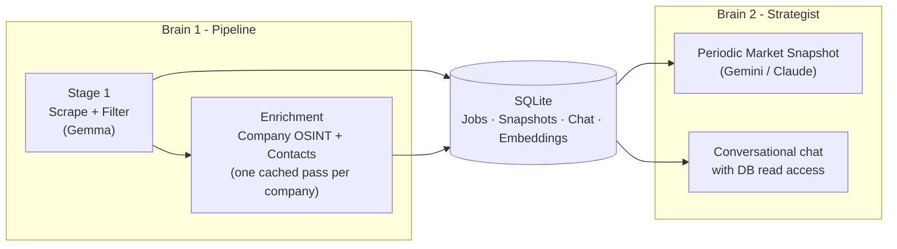

<!-- =========================================================
  README HEADER
  Replace the line below with your logo. 576px works well.
========================================================= -->
<p align="center">
  
</p>

<h1 align="center">HunterJobs ATS</h1>

<p align="center">
  <em>A candidate-side applicant tracking system.</em>
</p>

<p align="center">
  
  
  
  
  
  
  
  
</p>

<p align="center">
  <sub><strong>v0.9.0 just shipped</strong> - every scraper is mine now, jobspy is gone, and HeadHunter joins the sources. <a href="#changelog--roadmap">See changelog &darr;</a></sub>
</p>

---

## What it is

A local Python app that reads job listings so you don't have to. It scrapes them, judges each one against your profile, and for the ones worth your time it researches the company and digs up real people to contact. Everything runs on your machine against your own LLM key, stored in a plain SQLite file. No accounts, no cloud, no SaaS.

Sources: LinkedIn, Y Combinator startups (scraped straight off each company's ATS board), the monthly Hacker News "Who is Hiring?" thread, and HeadHunter for the CIS. Every scraper is mine - no third-party scraping library. The UI is a desktop dashboard: Jobs / Applied / Companies / Market Analyzer / Logs / Setup. Pick your sources, pick a backend (Gemini, Claude, Gemma, OpenAI, OpenRouter, or a local LM Studio model), paste your profile, hit Run. Jobs stream in as they're judged.

> **Work in progress.** Most of it works. Some bits are clanky. Feedback welcome.

<!-- HERO SCREENSHOT: Jobs tab with several expanded listings, dark theme, one colored row visible -->


---

## Why this exists

The job market is broken (a##) from a candidate's side. Recruiter spam, ghost listings, staffing agencies dressed up as employers, the same 12 roles re-uploaded across 6 boards. Spray 200 applications, hope for 3 interviews. Weeks of your life for almost no signal.

So this is the inverse of a normal ATS. Those serve employers, helping companies filter candidates. This one serves you: it filters everything *they* throw at the market down to a short list that actually matches what you can do, with enough context to write a real email to a real person.

**It is not an autoapply tool.** No mass submissions, no auto-sent emails, nothing pretending to be you on LinkedIn. It does the parts that suck (scraping, filtering, researching, finding who to contact) and then gets out of your way. Who you write to and what you say stays yours. Fewer and better leads, not more noise.

It started as a script I hacked together for myself, just to stop LinkedIn trash from eating my evenings. This is that idea grown up: it doesn't only filter, it researches the company and hands you real people to contact. Three LLM calls in a row, each doing one job properly.


---

## How it works

Two AI "brains" running locally on your machine, sharing one SQLite database.


```mermaid
flowchart LR
    subgraph Brain1["Brain 1 - Pipeline"]
        direction TB
        S1["Stage 1<br/>Scrape + Filter<br/>(Gemma)"] --> S2["Enrichment<br/>Company OSINT + Contacts<br/>(one cached pass per company)"]
    end

    subgraph Brain2["Brain 2 - Strategist"]
        Snap["Periodic Market Snapshot<br/>(Gemini / Claude)"]
        Chat["Conversational chat<br/>with DB read access"]
    end

    DB[(SQLite<br/>Jobs · Snapshots · Chat · Embeddings)]

    S1 --> DB
    S2 --> DB
    DB --> Snap
    DB --> Chat
```

**Brain 1** is the pipeline:

| Stage | What it does | LLM |
|------:|---|---|
| 1 | Scrape job boards, hard-reject obvious noise (keyword blacklist), then GOOD/MAYBE/BAD verdict against your profile - up to your per-scan budget; overflow queues for the next scan. | Gemma 4 (free tier on Google AI Studio) |
| Enrichment | For GOOD jobs, one cached pass per company: research (size, real stack, hiring signal, staffing-agency demote) **and** contact discovery in a single call. Contacts come from emails printed in the posting itself, YC profile founders, team pages, GitHub orgs, and web search - real names sorted decision-maker-first, guessed emails clearly marked, honest "unknown" when nothing's found. Cached 30 days, so five jobs at one company cost one pass. | Gemma 4 |

**Brain 2** is the strategist. Periodically aggregates your last 7 days of data and produces a brutal report on positioning, salary realism, surging skills, and patterns in your rejection pile. You can also chat with it - it has read-only SQL access to your jobs table so you can ask "show me the 11 GOOD jobs sorted by salary" and it'll run an actual query. An editable **persona** field shapes its voice and behavior across both the snapshot and chat.

Both Brains talk to a local SQLite database (WAL mode + FTS5 for full-text search) so the UI can read and write without locking.

### Job sources

HunterJobs pulls from four sources, mix-and-match in the Setup tab - each gets its own block with its own settings, and each listing is tagged with a colored badge so you can see where it came from (LinkedIn blue, YC red-orange, HN orange-yellow, hh red):

- **LinkedIn** - my own scraper. Asks for everything posted in a time window, in date order, and pages through it properly. Search terms are optional: leave them empty and it takes the whole firehose, which is useful for research and useless for a job hunt. It replaced a library that skipped pages, stopped on the first empty one, and sorted by relevance while reporting date order - on the same term and window mine returned 976 listings to its 119.
- **Y Combinator startups** *(v0.3)* - powered by my companion package [`ycombinator-jobs-scraper`](https://github.com/mustar22/ycombinator-jobs-scraper). It pulls currently-hiring YC companies from the public [yc-oss](https://github.com/yc-oss/api) dataset, filters them down to small early-stage startups (configurable team-size cap), and scrapes jobs straight from each company's ATS board (Greenhouse / Lever / Ashby), falling back to the Work-at-a-Startup postings on the company's public YC profile page when there's no discoverable ATS - **~100% of hiring companies covered**, no auth. These are the kinds of roles that rarely make it to LinkedIn.
- **Hacker News "Who is Hiring?"** *(new in v0.4.3)* - finds the newest monthly thread via the free HN Algolia + Firebase APIs (no auth) and parses each top-level comment into a job. Regex pulls the easy fields; the raw comment becomes the description Stage 1 judges.
- **HeadHunter (hh)** *(new in v0.9.0)* - the CIS market, which none of the other three reach. No API key; the search page carries its own state as JSON. Pick a region (there is no default) and optionally give it search terms of its own. It's the only source here that hands over **real salary ranges and exact posting timestamps**, and it names the work format outright instead of leaving me to guess from the title. Results don't come back in date order even when asked, so it filters by date client-side rather than stopping at the first old row.

YC and HN jobs can be filtered to **remote-only** before they ever reach Stage 1, so non-remote listings don't burn LLM calls. Freshness is windowed too: HN shares the global "Max hours old", while YC gets its own wider window (`yc_hours_old`, default 720h / 30 days) - YC startups leave postings up for months, so the tight job-board window would discard most of them. You can run any combination of sources, including YC or HN on their own.

### Similar past applications (RAG)

Every job that survives the keyword pre-filter gets embedded at scrape time and stored as a vector alongside the listing. When you open a job, HunterJobs surfaces the applications you've *already* applied to that are semantically closest to it - so you can see "I applied to three roles like this one, here's how they went" without digging through your history.

It's built to stay inside the single-file philosophy: embeddings live in the same SQLite database via [`sqlite-vec`](https://github.com/asg017/sqlite-vec), and vectors come from Gemini's `gemini-embedding-001` (768-dim) using the same backend you've already configured - no extra services, no separate vector store. A one-shot **Backfill** button in the Setup tab embeds your existing jobs. If the extension can't load on your platform, the rest of the app runs fine and the feature degrades quietly.

---

## Stack

Python 3.10+, NiceGUI dashboard (FastAPI + Vue under the hood), SQLite (WAL + FTS5 + sqlite-vec), Pydantic v2 for structured LLM outputs, and [`ycombinator-jobs-scraper`](https://github.com/mustar22/ycombinator-jobs-scraper) for the YC source. LinkedIn, HN and hh scraping are in-tree, no scraping library.

**LLM backends supported:**
- **Google Gemini / Gemma** via the google-genai SDK - Gemma 4 is free on Tier 1; Gemini also powers embeddings for the RAG feature
- **Anthropic Claude** - Sonnet 4.6 (recommended), Opus, Haiku 4.5
- **OpenAI** - for Brain 2
- **OpenRouter** - OpenAI-compatible, with a live model picker that fetches the catalog (searchable, free + paid models with pricing shown inline)
- **LM Studio** - any local OpenAI-compatible endpoint

You can mix and match. Brain 1's stages take separate backends - Stage 1 (high volume) and Stages 2/3 (research + contacts) - and when running on Gemma each stage picks its own model from a live picker. The default config uses free Gemma for the high-volume Brain 1 calls and a paid model only for Brain 2 (which runs ~1-2 calls per day).

---

## Install

```bash
git clone https://github.com/mustar22/hunterjobs-ats.git
cd hunterjobs-ats
python scripts/setup.py     # installs everything; see below
```

`scripts/setup.py` is the canonical setup: it installs HunterJobs (editable, deps
from `requirements.txt`), clones the companion [`ycombinator-jobs-scraper`](https://github.com/mustar22/ycombinator-jobs-scraper)
into a sibling directory and editable-installs it, verifies the scraper imports
from local source, and seeds `config.json` / `keys.py` (then edit `keys.py` and
add your API key(s)). Idempotent - re-run it anytime to pull scraper updates.

> A bare `pip install -e .` does **not** install the YC scraper - the YC source
> will be skipped until you run `scripts/setup.py`.

Then launch with whichever is easier:

- **Windows:** double-click `_start.bat`
- **macOS / Linux:** `chmod +x _start.sh && ./_start.sh`
- **Or from terminal:** `python dashboard.py`

Open http://localhost:8080 in your browser. A default `config.json` is created automatically on first run - set your profile in the Setup tab.

You only need a `GOOGLE_API_KEY` to start - get one free at https://aistudio.google.com/apikey. The other keys (`ANTHROPIC_API_KEY`, `OPENAI_API_KEY`, `OPENROUTER_API_KEY`, `GITHUB_PAT`) are optional - `GITHUB_PAT` lets enrichment read GitHub org members for contacts. The YC and HN sources need no key - they use public endpoints.

> **Running the tests?** Install pytest first: `pip install pytest`, then run `pytest` from the repo root.


---

## Configure

Open the **Setup** tab and:

1. Paste your profile into the **Profile** textarea. Be specific. Stack, years of experience, salary floor, location constraints, hard nos. The richer this is, the better Stage 1 filters.
2. Pick your **sources** - LinkedIn, Y Combinator startups, Hacker News "Who is Hiring?", and/or HeadHunter, in any combination. For YC you can set a max team size (to target small startups) and a YC-specific freshness window ("YC max hours old", default 720); YC, HN and hh each have a remote-only toggle. hh needs a region picked, it has no default. The global "Max hours old" governs LinkedIn, HN and hh.
3. Edit **Search Terms** - one per line. LinkedIn and hh each have their own box, so terms don't bleed between them. Leave a box empty and nothing is scraped for that source; there is no default term. (YC and HN read whole companies/threads, so Stage 1's LLM does the matching there.)
4. Edit the **Hard Rejects** keyword list. Anything matched here gets auto-BAD without burning an LLM call. Default list catches the obvious staffing/recruiting/US-only stuff. You can export/import this as a `.txt` to share with others. The **salary floor** (monthly USD) is a hard reject too, but only against a stated salary - a listing that doesn't name a number is never rejected for it. Set it to 0 to switch it off.
5. Pick your backends. Brain 1's Stage 1 and Enrichment are set separately, and every picker is live - it asks the provider what it serves today rather than reading a list I hardcoded and forgot to update. Defaults are sensible: Gemma 4 for Brain 1, Gemini Flash for Brain 2. On Google you can pick either family; Gemma is the free tier (Google may train on what you send it), Gemini is paid and they don't.
6. **Fastest start: hit the orange "Parse server DB" button** at the top of Setup. It pulls down ~1,900 companies I've already researched plus ~3,100 YC and Hacker News listings, so your first run has something to judge and skips the research bill on companies already known. Nothing in it is judged for you - your profile decides. It brings no contacts and no LinkedIn listings; hunt and scrape those yourself.
7. **Strongly recommended: add a `TAVILY_API_KEY` or `SERPER_API_KEY`** (both have free tiers). The keyless fallback works from some connections and not others - datacenter IPs get starved and several countries get captcha-walled, and when search silently returns nothing the company research quietly gets much worse. I found this the hard way: 92% of one enrichment run came back with no sources read. With a key it was 0%.
8. (Optional) Hit **Backfill embeddings** to enable "similar past applications" over jobs you scraped before the RAG feature existed.


---

## Privacy

Everything is local. Your profile, scraped jobs, notes, color labels, chat history, embeddings - all in `core/db/hunterjobs_ats.db` on your machine. The only network calls go to the LLM provider you pick (or none at all if you use LM Studio), plus the job-board/ATS endpoints when scraping.

Contact discovery only surfaces publicly available information - names and roles from company team pages, public web results, and public GitHub org membership - so you can address one real person instead of `careers@`. It guesses nothing: when there's no public signal, it says so.

Your `keys.py` is gitignored. Don't commit it.

---

## Known limitations

- **LinkedIn rate-limits, and it lies when it does.** Rapid requests make live listings return 404, so the scraper paces itself and treats a single 404 as a rumour rather than a death. A search term can still produce nothing on a given day; when coverage is incomplete the log says so instead of pretending.
- **YC WaaS-fallback jobs have no real posted date** - companies without a discoverable ATS board only expose rounded relative ages ("5 months"). Rather than show a date I back-computed and can't defend, those listings say `listed <when I first saw it>` - which is the only thing I actually know. The first-seen ledger decides what's new.
- **LinkedIn doesn't always return a posting date or location** - some rows show blank for those. That's upstream data, not a bug.
- **Local models < 20B params chat poorly with tools.** They'll echo the tool result back into their text. Snapshot generation with local models is fine; chat works best with Gemini or Claude.
- **Contact discovery is best-effort.** Team pages vary wildly, GitHub org membership is often private, and permuted emails are educated guesses (marked as such). Often the honest answer is "no public contact found" - that's by design, not a failure. Use the per-person email search on the few people who matter.
- **Founders and CEOs mostly won't reply.** This one isn't a bug I can fix. HunterJobs will hand you a real name and often a real address, and then that address will sit there in silence, unread, while the company keeps posting that they're desperately hiring. Write to them anyway. The ones who do reply tend to reply properly, and that beats a hundred applications into a form.

---

## Changelog & Roadmap

### v0.9.0 - shipped

- **Every scraper is mine.** Dropped `python-jobspy`: same term, same window, both run to exhaustion, **976 listings to its 119**. It skipped pages, stopped on the first empty one, sorted by relevance while reporting date order, and passed filters LinkedIn ignores. None of it raised an error. Indeed went with it - its scraper had returned nothing across 21 terms
- **HeadHunter (hh) source** - the CIS market, which nothing else here reached. No API key: the documented API 403s now, but every search page embeds its own state as JSON. The only source here that gives **real salary ranges and exact timestamps**. Results aren't in date order even when you ask, so it filters client-side instead of stopping at the first old row
- **Company research actually works** - a listing with no website left research nothing to read. It links to a company page, and that page has the real domain. Research failures **37 → 0**, contacts **6 → 84**, and 11 staffing agencies caught free because they file themselves under "Staffing and Recruiting"
- **Listing pulse** - opt-in, per source. Asks listings whether they still exist instead of expiring them on a timer. The ten oldest in my pool were five weeks old and every one was still open
- **Per-source blocks in Setup** - own toggle, own settings, own search terms. No invented defaults: empty terms means that source doesn't run
- **Fixed a scraper quietly losing 36% of Hacker News** - a 200 cap on a 311-comment thread, always trimming the tail. Every stage logs its own losses now
- **The salary floor is real now.** It was a Setup field that filtered nothing - editable, documented, wired to nothing. It rejects for free, before any LLM call, but only when the stated pay converts cleanly to USD and still lands under your floor. No salary means no rejection: ~80% of hh tech listings state none, and silence is not evidence of low pay. Rates come from a keyless source, cached, and a cache older than a week refuses to convert rather than quote a stale number
- **Salaries render as money** - `83 000-220 000 ₽ (~$2,689/mo) net` - with gross/net shown, because a pay figure without it is off by ~13% and I can't defend it. hh quotes RUR and BYR, the codes retired in 1998 and 2016, so those alias through to RUB and BYN or half the rows convert to nothing
- **Degeneration guard catches phrase loops**, not just single stuttered words
- Test suite 134 → 224

### v0.8.5 - shipped

- **Parse server DB** - one button pulls down ~1,900 companies already researched on [hunterjobsats.com](https://hunterjobsats.com) plus ~3,100 YC and HN listings, so your first run has something to judge
- **What the seed never contains**: contacts, my verdicts, or LinkedIn listings. Everything arrives QUEUED - your profile decides, not mine
- **Both reads survive** - imported research lands in its own table and never overwrites yours. SERVER INTEL sits beside YOUR RESEARCH; where they disagree is worth a look
- **Companies tab** - search everything you have intel on. Useful the night before an interview
- **Live model pickers everywhere** - every backend asks the provider what it serves today. Google offers Gemini as well as Gemma; the paid tier means they don't train on what you send
- **Run one step on its own** - Scrape only / Enrich only, for banking listings now and spending later
- Fixed: the Companies tab only queried your own research, so every new install saw an empty grid
- Test suite 133 → 134

### v0.7.0 - shipped

- **Write your own evaluation brief** - the judge's mission is yours to rewrite. GOOD/MAYBE/BAD stays fixed, but what counts as good is up to you. Point it at any listing-shaped text and it judges that instead
- **Work mode and visa flags** - remote/hybrid/onsite and US-authorization demands, both as badges, both filterable. Rough by nature, so hints not gospel
- **Claude as a Stage 1 backend** - Haiku by default, because Stage 1 reads hundreds of listings and small models are the point
- **Per-source queues** - pick HN only and you get HN only
- **Token lock on Stage 1** - 256 tokens per verdict. A rewritable prompt shouldn't be able to run up your bill
- **YC per-company cap** - learned the hard way when a YC slug collided with a UK staffing giant and 2,575 nurse listings walked in
- Test suite 120 → 133

### v0.6.0 - shipped

- **Enrichment rebuilt** - the old Stage 2 and Stage 3 merged into one LLM call per company, fed with everything gathered first: YC data, the company site, team pages, GitHub orgs
- **YC founders as contacts** - names and titles from the public YC profile, marked `verified via yc`. For YC jobs this alone puts a decision-maker on nearly every card
- **Emails read straight from postings** - common on HN, free, and skips the rest of the hunt
- **Company cache** - research and contacts once per company across jobs *and* scans. N listings at one company = one pass
- **Pluggable web search** - optional Tavily/Serper keys; keyless ddgs stays the default so no account is ever required
- Contact precision: strict person-name guard, team-page crawl skipped when founders are known
- Test suite 94 → 120

### v0.5.0 - shipped

- **First-seen ledger** - a job is judged **once, ever**. Re-scrapes and listing edits never burn another LLM call
- **Per-scan LLM budget** - caps Stage 1 verdicts per scan; overflow stored QUEUED and drained oldest-first
- **Usage metering** - every scan writes its own counts. Killed scans close out honestly as `interrupted`
- **Honest dates** - estimated dates are flagged, shown as `~date`, and never drive freshness filtering
- **"First seen" everywhere** - sorts newest-sighted-first, and counts are split so free keyword kills stop masquerading as LLM verdicts
- **UI** - expansions survive refreshes; guessed emails marked red and sorted last, because guessed means guessed
- Migration: `python scripts/migrate_v05.py`. Test suite 58 → 94

### v0.4.5 - shipped

- **Geo-eligibility filtering** - a Setup field for where you can legally work. Rejects region-locked, sponsorship-dependent and wrong-region-"remote" roles with a `geo:` reason. Empty field = no assumptions
- **~100% YC coverage via Work at a Startup**, with a YC-specific freshness window since WaaS listings stay up for months
- **RAG on/off toggle** and a canonical `python scripts/setup.py`
- Removed an unverified GitHub fallback that surfaced unrelated developers' personal emails as "verified"; ATS hosts now rejected in `clean_domain` so permutations stop guessing at shortener domains

### v0.4.3 - shipped

- **Hacker News "Who is Hiring?" source** - newest monthly thread via free HN APIs, no auth, each comment parsed into a job
- **Per-stage Gemma model selection** from a live catalog
- Fixes: tightened the agency demote, and a guard against runaway company summaries

### v0.4.2 - shipped

- **Real contact discovery** - team pages, web search and GitHub org members, sorted decision-maker-first
- **YC freshness filter**, so stale listings stop leaking in

### v0.4.1 - shipped

- **Stage 3 honesty fix** - stopped fabricating names and drafts (the model was inventing the same fake person across companies); honest "no contact" when none found

### v0.4 - shipped

- **OpenRouter backend** for both brains, with a live searchable model picker
- **Brain 2 persona** - an editable voice field shaping both snapshot and chat
- **Package restructure** into `core/` / `pipeline/` / `ui/`; `dashboard.py` from ~2,300 lines to a thin entry point
- Fixes: stale-PID guard so brains restart cleanly

### v0.3 - shipped

- **Y Combinator startups as a source**, via the companion [`ycombinator-jobs-scraper`](https://github.com/mustar22/ycombinator-jobs-scraper) package
- **Source picker + badges** - run LinkedIn / Indeed / YC in any combination
- **Remote-only filter for YC jobs**, so they don't burn LLM calls
- Fixes: duplicate-embedding crash on multi-location listings

### v0.2 - shipped

- **RAG over past applications** - sqlite-vec + Gemini embeddings, surfaced passively in each job's panel
- **OpenAI backend** for Brain 2
- **Manual "Move to BAD"** on GOOD/MAYBE jobs
- **pytest suite + GitHub Actions CI**
- **Hardened JobSpy scraping** - runtime fix for the 1.1.82 invalid-country crash

### Later

- Per-source salary floors - one global floor can't fit both the US and the CIS
- Multi-thread chat (currently one persistent conversation)
- Outreach send-tracking with calendar reminders

---

## Support this

HunterJobs is free and stays free - Apache 2.0, runs entirely on your machine,
no account needed. I built it because I was job hunting and the boards were
wasting my life. If it saves you an evening, you can throw something at it:

- [Name your own amount](https://checkout.dodopayments.com/buy/pdt_0Nk0N0J2419EX7YOK9Z5Z?quantity=1)
- [Buy me a coffee](https://checkout.dodopayments.com/buy/pdt_0Nk0NUJfhOChu1P4PrfEC?quantity=1)
- [Buy me dinner](https://checkout.dodopayments.com/buy/pdt_0Nk0NglB5d7k13Mntq8TQ?quantity=1)

Entirely optional and it unlocks nothing - there is no paid version of this
repo. If you'd rather not, starring it or opening a good issue is worth plenty.

There is a [hosted version](https://hunterjobsats.com) if you'd rather not run
it yourself: same judge, same pre-researched companies, no setup.

---

## Feedback

This is a tool I'm using daily for my own job hunt. If something's broken or weird, open an issue. If you have ideas, also open an issue. If you want to use it and got stuck on setup, definitely open an issue - the install docs probably need work

PRs welcome but please open an issue first so we can sync on direction

---

## License

Apache-2.0 - see [LICENSE](LICENSE).